  <picture>
    <source media="(max-width: 600px) and (prefers-color-scheme: light)" srcset="./assets/generated/galaxy-header-mobile-light.svg">
    <source media="(max-width: 600px)" srcset="./assets/generated/galaxy-header-mobile.svg">
    <source media="(prefers-color-scheme: light)" srcset="./assets/generated/galaxy-header-light.svg">
    
  </picture>

  

  

    
    
    
    
  

## Executive Profile & Engineering Focus

I am **Minh Khai**, a software engineer in Vietnam interested in the point where dependable software meets the physical world. My work and learning span backend architecture, modern web applications, embedded systems, and hardware experimentation.

I approach engineering as a complete system: understand the real constraint, design clear boundaries, build the smallest reliable solution, and improve it with evidence. I care about code that remains understandable under change—not complexity for its own sake.

<table>
  <tr>
    <td width="33%" valign="top">
      <h3>Cloud & Backend</h3>
      
API design, data modeling, distributed workflows, caching, observability, and maintainable service boundaries.

    </td>
    <td width="33%" valign="top">
      <h3>Product Engineering</h3>
      
Responsive interfaces, end-to-end feature delivery, thoughtful developer experience, and pragmatic automation.

    </td>
    <td width="33%" valign="top">
      <h3>Edge & Hardware</h3>
      
Embedded programming, robotics concepts, telemetry, PCB exploration, and software–hardware integration.

    </td>
  </tr>
</table>

### How I work

- **Clarity before cleverness** — explicit architecture, readable code, and decisions that teammates can revisit.
- **Reliability by design** — validation, predictable failure modes, observability, and testing at meaningful boundaries.
- **End-to-end ownership** — from problem framing and data design to delivery, automation, and iteration.
- **Continuous learning** — exploring systems deeply, documenting what matters, and turning experiments into reusable knowledge.

---

## Technology Landscape

  <picture>
    <source media="(max-width: 600px) and (prefers-color-scheme: light)" srcset="./assets/generated/tech-stack-mobile-light.svg">
    <source media="(max-width: 600px)" srcset="./assets/generated/tech-stack-mobile.svg">
    <source media="(prefers-color-scheme: light)" srcset="./assets/generated/tech-stack-light.svg">
    
  </picture>

   
  

---

## GitHub Activity

  <picture>
    <source media="(max-width: 600px) and (prefers-color-scheme: light)" srcset="./assets/generated/stats-card-mobile-light.svg">
    <source media="(max-width: 600px)" srcset="./assets/generated/stats-card-mobile.svg">
    <source media="(prefers-color-scheme: light)" srcset="./assets/generated/stats-card-light.svg">
    
  </picture>

 

  

  
<strong>Contribution animation</strong>

   
  

    <picture>
      <source media="(prefers-color-scheme: dark)" srcset="https://raw.githubusercontent.com/1seik4i/1seik4i/output/github-snake-neon.svg">
      <source media="(prefers-color-scheme: light)" srcset="https://raw.githubusercontent.com/1seik4i/1seik4i/output/github-contribution-grid-snake.svg">
      
    </picture>
  

---

  <h3>Build with purpose. Improve with evidence.</h3>
  
Interested in thoughtful software, autonomous systems, and ambitious engineering problems.

  

