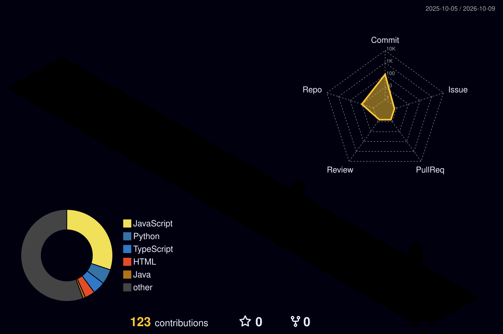

<div align="center">

  <!-- 🌌 Generated from the public repositories with vinimlo/galaxy-profile -->
  <picture>
    <source media="(max-width: 600px) and (prefers-color-scheme: light)" srcset="./assets/generated/galaxy-header-mobile-light.svg">
    <source media="(max-width: 600px)" srcset="./assets/generated/galaxy-header-mobile.svg">
    <source media="(prefers-color-scheme: light)" srcset="./assets/generated/galaxy-header-light.svg">
    
  </picture>

  <!-- ⚡ Dynamic Terminal Typing SVG -->
  <p align="center">
    <a href="https://github.com/1seik4i">
      
    </a>
  </p>

  <!-- 🌐 Social & Quick Connect Badges -->
  <p align="center">
    <a href="mailto:1seik4i@gmail.com">
      
    </a>
    <a href="https://www.facebook.com/minh.khai.993993/" target="_blank">
      
    </a>
    <a href="https://www.tiktok.com/@1seik4i" target="_blank">
      
    </a>
    <a href="https://github.com/1seik4i">
      
    </a>
    <a href="https://komarev.com/ghpvc/?username=1seik4i&color=00f5d4&style=for-the-badge&label=%E2%97%88+VISITORS">
      
    </a>
  </p>

</div>

---

### 💻 Executive Profile & System Architecture

```typescript
interface SoftwareArchitect {
  name: "Minh Khai (1seik4i)";
  role: "Lead Software Architect & Robotics Systems Engineer";
  location: "Vietnam 🇻🇳 (UTC+7)";
  domains: ["Distributed Cloud Architecture", "Autonomous Edge Systems", "Hardware R&D"];
  currentMission: "Building Autonomous Aerial Delivery Logistics for Vietnam 🚁";
  coreValues: [
    "Clean Architecture & High Concurrency",
    "Microsecond-level System Reliability",
    "Flawless Integration of Hardware & Software"
  ];
}
```

- 🔭 **Strategic Vision:** Developing autonomous aerial navigation, dynamic pathfinding algorithms, and cloud telemetry hubs.
- ⚡ **Engineering Core:** Multi-tenant distributed backends, real-time WebSocket pipelines, and embedded RTOS firmware.
- 🛠️ **Hardware Craft:** Custom PCB design (RP2040 / ATmega), precision acoustic keyboard tuning, and Hi-Fi analog/DSP audio circuits.
- 💬 **Collaboration:** Actively exploring impactful open-source initiatives, R&D ventures, and high-performance system designs.

---

### 🚀 Featured Engineering Projects

<table>
  <tr>
    <td width="50%" valign="top" style="background-color: #0d1117; border: 1px solid #21262d; border-radius: 8px; padding: 16px;">
      <h3 align="left">🚁 Autonomous Drone Delivery System</h3>
      <p><b>Next-Gen Point-to-Point Aerial Transport & Telemetry Hub</b></p>
      <ul>
        <li>Autonomous mission pathfinding, telemetry synchronization, and payload drop control.</li>
        <li><b>Stack:</b> <code>C/C++</code>, <code>Embedded RTOS</code>, <code>Node.js Cluster</code>, <code>React Dashboard</code>.</li>
        <li><b>Milestone:</b> <code>Prototype Architecture & R&D Phase</code></li>
      </ul>
    </td>
    <td width="50%" valign="top" style="background-color: #0d1117; border: 1px solid #21262d; border-radius: 8px; padding: 16px;">
      <h3 align="left">⌨️ Custom PCB & Acoustic Engineering</h3>
      <p><b>Precision Mechanical Hardware & Sound Dynamics Lab</b></p>
      <ul>
        <li>Custom PCB routing, QMK/VIA firmware optimization, switch lubing & acoustic tuning.</li>
        <li><b>Stack:</b> <code>RP2040 MCU</code>, <code>C Firmware</code>, <code>KiCad</code>, <code>Acoustic DSP</code>.</li>
        <li><b>Milestone:</b> <code>Active Custom Builds & Testing</code></li>
      </ul>
    </td>
  </tr>
  <tr>
    <td width="50%" valign="top" style="background-color: #0d1117; border: 1px solid #21262d; border-radius: 8px; padding: 16px;">
      <h3 align="left">🛰️ High-Concurrency Distributed Core</h3>
      <p><b>Resilient Cloud Microservices & Real-Time Data Pipeline</b></p>
      <ul>
        <li>Ultra-low latency REST/gRPC endpoints, WebSocket broker, and distributed caching.</li>
        <li><b>Stack:</b> <code>.NET Core</code>, <code>Node.js</code>, <code>Redis</code>, <code>MongoDB</code>, <code>Docker</code>.</li>
        <li><b>Milestone:</b> <code>Continuous Deployment</code></li>
      </ul>
    </td>
    <td width="50%" valign="top" style="background-color: #0d1117; border: 1px solid #21262d; border-radius: 8px; padding: 16px;">
      <h3 align="left">🎧 Hi-Fi Audio DSP & Acoustic Chain</h3>
      <p><b>Audiophile Lossless Signal Processing & Circuit Calibration</b></p>
      <ul>
        <li>Balanced 4.4mm DAC/Amp tuning, DSP equalization filters, lossless stream purity.</li>
        <li><b>Stack:</b> <code>Lossless DSP</code>, <code>Planar Drivers</code>, <code>Analog Audio Filters</code>.</li>
        <li><b>Milestone:</b> <code>Acoustic Chamber Calibration</code></li>
      </ul>
    </td>
  </tr>
</table>

---

### 🛠️ Technology Stack & Toolchain

<div align="center">

#### ⚡ Core Languages & Runtimes
<a href="https://skillicons.dev">
  
</a>

<br/>

#### ⚛️ Modern Frontend & UI Architecture
<a href="https://skillicons.dev">
  
</a>

<br/>

#### 🛰️ Distributed Backend, Cloud & Databases
<a href="https://skillicons.dev">
  
</a>

<br/>

#### 🤖 Embedded IoT, Robotics & Hardware
<a href="https://skillicons.dev">
  
</a>

<br/>

#### 🧰 DevOps, Cloud Infrastructure & Tooling
<a href="https://skillicons.dev">
  
</a>

</div>

---

### 📊 GitHub Real-Time Telemetry & Activity

<div align="center">

  <!-- Live Contribution Activity Graph -->
  <p align="center">
    
  </p>

</div>

<br/>

<div align="center">
  <picture>
    <source media="(max-width: 600px) and (prefers-color-scheme: light)" srcset="./assets/generated/stats-card-mobile-light.svg">
    <source media="(max-width: 600px)" srcset="./assets/generated/stats-card-mobile.svg">
    <source media="(prefers-color-scheme: light)" srcset="./assets/generated/stats-card-light.svg">
    
  </picture>
</div>

<br/>

<div align="center">
  <table border="0" style="border-collapse: collapse; width: 100%; max-width: 880px;">
    <tr>
      <td align="center" width="50%" style="padding: 4px;">
        
      </td>
      <td align="center" width="50%" style="padding: 4px;">
        
      </td>
    </tr>
    <tr>
      <td colspan="2" align="center" style="padding: 4px;">
        
      </td>
    </tr>
  </table>
</div>

---

### 🏙️ 3D Contribution City

<div align="center">
  
</div>

<br/>

<!-- 🐍 Contribution Snake Eater Animation -->
<div align="center">
  <picture>
    <source media="(prefers-color-scheme: dark)" srcset="https://raw.githubusercontent.com/1seik4i/1seik4i/output/github-snake-neon.svg">
    <source media="(prefers-color-scheme: light)" srcset="https://raw.githubusercontent.com/1seik4i/1seik4i/output/github-contribution-grid-snake.svg">
    
  </picture>
</div>

---

### 📜 Engineering Philosophy

<div align="center">
  
</div>

<br/>

<!-- ⚡ Sleek Footer -->
<div align="center">
  <a href="https://github.com/1seik4i">
    
  </a>
</div>
